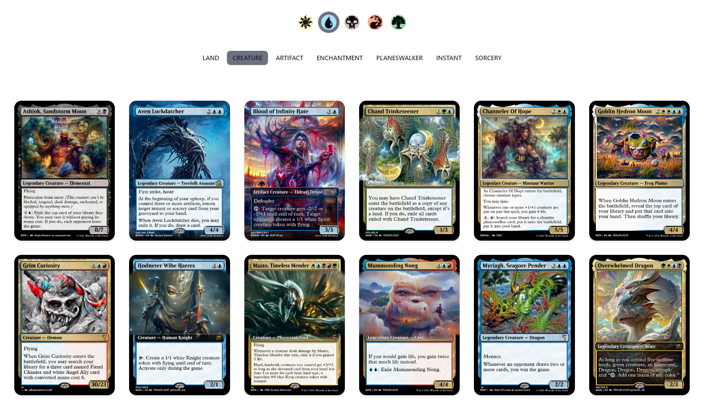

<h1 align='center'>
  Robo Rosewater Database
</h1>

## About
The Robo Rosewater website (named after the current head designer for Magic the Gathering) is based on the twitter account <a href='https://twitter.com/roborosewaterm'>@roborosewaterm</a>, who posts MTG cards generated by an AI. The website was built to organize my favorite cards and offer some options for searching / filtering through them in a way that wasn't possible on twitter.

## Future Plans
- Add an upload form and sign in for users to add their own cards
- Add more advanced search features
